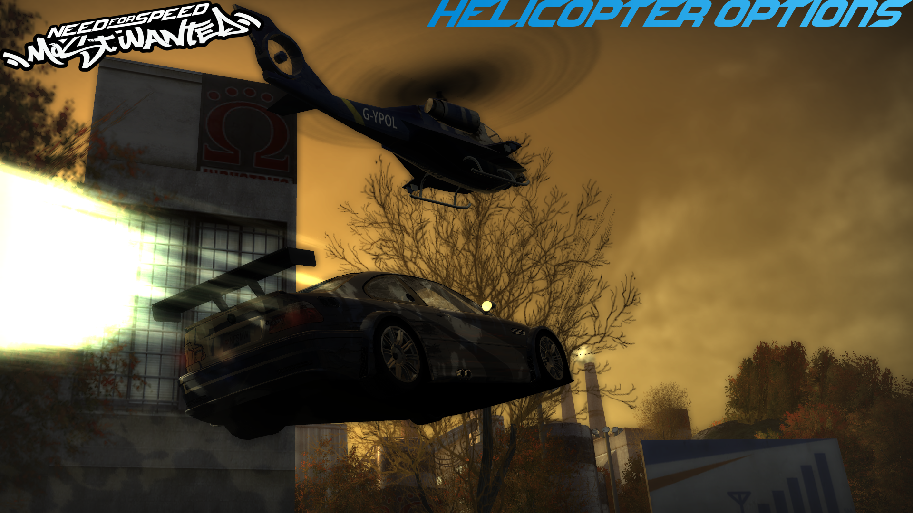

# NFSMW HelicopterOptions V2.2.1

A police helicopter overhaul for **Need for Speed: Most Wanted (2005)**.

The stock police helicopter tends to hang far behind, dawdle on open roads, and
lose track of you easily. HelicopterOptions makes it fly and chase more like a
real pursuit helicopter: it keeps a sensible speed, anticipates where you are
going, reacts when you make sudden turns or stop, and stays stable instead of
tipping over. Almost everything is optional and configurable, so you can tune
it from "slightly better than stock" up to "genuinely hard to shake."

---

## Features

- **Keeps up with you.** The helicopter no longer crawls along at a fixed slow
  speed on straights; it holds a useful chase speed so it stays in the fight,
  without becoming impossible to lose.
- **Anticipates your movement.** It aims a little ahead of your car based on
  your speed and heading, and pulls that aim back in when you brake or turn, so
  it corners with you instead of sailing off.
- **Reacts to sudden turns.** When you make a hard U-turn or handbrake turn, the
  helicopter recognizes it and re-centers on you instead of flying far past.
- **Handles you stopping.** When you stop, it holds a position close by rather
  than drifting away into the distance.
- **Stays stable.** A built-in safety system gently levels the helicopter out if
  it ever rolls, pitches, or spins too far, so it recovers instead of tumbling.
- **Works above 60 FPS.** The game's helicopter was built for 60 FPS and flies
  badly when the frame cap is removed - it stops swaying, and above 200 FPS it
  freezes in place entirely. Whatever frame rate you play at, the helicopter now
  flies the way it was meant to.
- **Talks on the police radio.** Restores the helicopter radio speech that
  shipped with the game but is almost never heard: the dispatcher announces the
  helicopter, and the pilot reports spotting you, losing you, your position when
  you stop, low fuel, leaving, and more - all through the game's own radio, with
  the normal radio effect and without talking over other chatter.
- **Fully configurable attacks.** Control how often it attacks, from which
  angles, how long it keeps trying, and how long it waits between attempts - or
  turn attacks off entirely for a follow-only helicopter.
- **Optional extras.** Make it never lose sight of you, never run out of fuel,
  fly higher or lower, turn more sharply, and more.
- **Safe by design.** It only runs on the supported game version, checks every
  change before applying it, cooperates with other mods, and undoes all of its
  changes when the game closes. A built-in safety net hands control back to the
  game if anything ever goes wrong.

Everything except a few safety features is **off by default** and easy to switch
on. See the [Configuration](#configuration) section.

---

## Requirements

- **Need for Speed: Most Wanted (2005)**, English PC version **1.3**.
- An **ASI loader**, such as Ultimate ASI Loader. This is a small file that
  lets the game load `.asi` mods from its `scripts` folder. If you already use
  other `.asi` mods, you already have one.

---

## Supported game version

This mod is built for the **English PC v1.3** executable of Need for Speed:
Most Wanted (2005) - the same widely used version most mods target. It checks
the game version when it starts. If it does not recognize the game, it does
nothing and leaves every file untouched, then explains this in its log.

If you are certain your game is compatible and want it to try anyway, you can
set `AllowUnsupportedExe = 1` in `GeneralSettings.ini`, but this is untested
and not recommended.

---

## Installation

1. Make sure you have an ASI loader installed (see [Requirements](#requirements)).
2. Copy the contents of this package into your game's `scripts` folder so that
   you end up with:

   ```
   scripts\HelicopterOptions.asi
   scripts\HelicopterOptions\Configuration\   (the settings files)
   scripts\HelicopterOptions\Logs\            (created automatically)
   ```

3. Start the game. On the first run the mod creates its log at
   `scripts\HelicopterOptions\Logs\HelicopterOptions.log`. Any settings files
   that are missing are recreated with default values.

To uninstall, delete `HelicopterOptions.asi` and the `HelicopterOptions`
folder from `scripts`.

---

## Configuration

All settings live in **plain-text `.ini` files** inside
`scripts\HelicopterOptions\Configuration\`. Open them in any text editor.
Each setting has a short explanation, a recommended range, and its default
value written right above it. **Changes take effect the next time you start
the game.**

The settings are split across fifteen files by topic:

| File | What it controls |
|---|---|
| `GeneralSettings.ini` | Logging, startup, frame rate, and game version |
| `Radio.ini` | Restored helicopter police-radio speech |
| `Speed.ini` | Keeping the helicopter's chase speed sensible |
| `Predictions.ini` | Anticipating your movement and reacting when you stop |
| `Recovery.ini` | Handling sudden turns, getting stuck, and circling |
| `Leading.ini` | How far ahead of your car it aims |
| `Altitude.ini` | Flying height and stability protection |
| `Skids.ini` | The attack (swoop / ram) behavior |
| `Aggression.ini` | How pushy it is about attacking |
| `SteeringControl.ini` | Turning sharpness and motion smoothing |
| `Acceleration.ini` | How hard it can accelerate and corner |
| `Visibility.ini` | Whether it can lose sight of you |
| `AIHelicopterBehavior.ini` | Safety net and leave/fuel behavior |
| `Navigation.ini` | Optional height/distance limits for stock flight |
| `Debug.ini` | Extra logging and experimental options |

A friendlier walkthrough with common setups is in
[CONFIGURATION_GUIDE.md](CONFIGURATION_GUIDE.md).

A few popular changes:

| Goal | Change |
|---|---|
| Helicopter follows but never attacks | `Skids.ini` → `[SkidAttack] FollowOnly=1` |
| It never runs out of fuel and leaves | `AIHelicopterBehavior.ini` → `[ExitBehavior] DisableFuelBasedExit=1` |
| It never loses sight of you (harder) | `Visibility.ini` → `[ChopperVision] Enable=1` and `SeeThroughWalls=1` |
| It attacks more often | `Aggression.ini` → `[Aggression] Enable=1`, raise `AttackFrequency` and `AttackWillingness` |
| Stop constant ramming | `Skids.ini` → `[SkidAttack] ReattackDelaySeconds=8` |
| Turn off the helicopter radio speech | `Radio.ini` → `[HeliRadioChat] Enable=0` |
| Playing above 60 FPS | Nothing to do - handled automatically (`GeneralSettings.ini` → `[FrameRate]`) |

---

## Compatibility

- HelicopterOptions changes the game only in memory, while it runs. It never
  edits your game files, and it undoes all of its changes when the game closes.
- It works alongside other `.asi` mods. If another mod has already changed the
  same part of the game, HelicopterOptions notices, skips just that feature,
  and leaves everything else working. Skipped features are noted in the log.
- It only affects the police helicopter. Cars, ground police, and the rest of
  the game are untouched.

---

## Troubleshooting

If something does not work or behaves oddly:

1. Open `scripts\HelicopterOptions\Logs\HelicopterOptions.log`. It records what
   the mod did at startup and any problems it ran into, in plain language.
2. For more detail, set `VerboseLogging = 1` in `GeneralSettings.ini`, and to
   watch the helicopter's behavior over time set `Enable = 1` under
   `[Telemetry]` in `Debug.ini`. Restart, reproduce the issue, then read the
   log.
3. If you report a problem, include that log file and a short description of
   what the helicopter did.

Common notes:

- **Nothing changed in-game.** Make sure the ASI loader is installed and that
  the files are in `scripts\` exactly as shown in [Installation](#installation).
  Check the log for a startup line and a "supported game version" message.
- **"Unsupported game version" in the log.** Your game is not the English PC
  v1.3 version this mod supports. See [Supported game version](#supported-game-version).
- **A feature seems inactive.** Check that its section's `Enable` is set to `1`,
  and check the log for a note that another mod changed the same game code.

---

## Known limitations

Some things people often ask for - multiple helicopters at once, helicopter
minimap icons, avoiding buildings, and a few others - are not included, because
they cannot be done reliably in this game without causing glitches. These are
described honestly in [KNOWN_LIMITATIONS.md](KNOWN_LIMITATIONS.md).

The stock game can also fly the helicopter quite high in some situations.
`Navigation.ini` offers an optional height limit that helps in many cases; see
that file and the known-limitations notes.

---

## Credits

- Created by **eatincrispies / XeroAbsolute**.
- The game-structure reference **NFSPluginSDK** by berkayylmao was used to
  cross-check several internal layouts.
- Thanks to fierelier for MinGW Support 
- Thanks to the Need for Speed modding community for tools and documentation.

No Electronic Arts source code or game assets are included. The mod only
applies its own changes to the running game.

---

## License

Released under the **MIT License**. See [LICENSE.txt](LICENSE.txt).
